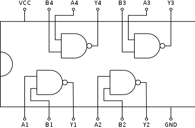

# 7400: Quad 2-Input NAND Gate

- Type: [Gate](gates.md)
- DIP: 14-pin
- Number of elements: 4
- Inputs per element: 2
- Outputs per element: 1

## Description

Provides four NAND gates with two inputs and an output each.

## Inputs and Outputs

| Label | Description            |
| ----- | ---------------------- |
| An    | First input of gate n  |
| Bn    | Second input of gate n |
| Yn    | Output of gate n       |

## Function Table

| An  | Bn  | Yn  |
|:---:|:---:|:---:|
| L   | L   | H   |
| L   | H   | H   |
| H   | L   | H   |
| H   | H   | L   |

- H: HIGH voltage level
- L: LOW voltage level

## Pin Configuration

## Datasheets

- [7400, 74LS00, 74S00 by Texas Instruments](http://www.ti.com/lit/ds/symlink/sn74ls00.pdf)
- [74LS00 by ON Semiconductor](http://ecee.colorado.edu/~ecen3100/lab2_files/SN74LS00Ndatasheet.PDF)
- [74F00 by Philips](http://www.nxp.com/documents/data_sheet/74F00.pdf)
- [74HC00, 74HCT00 by NXP](http://www.nxp.com/documents/data_sheet/74HC_HCT00_Q100.pdf)
- [74HC00 by ON Semiconductor](https://www.onsemi.com/pub/Collateral/74HC00.PDF)
