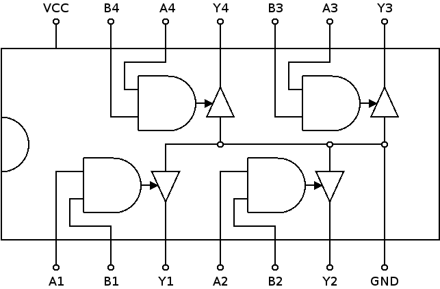

# 7403: quad 2-input NAND gate, open collector output

- Type: [gate](gates.md)
- DIP: 14-pin
- Number of elements: 4
- Inputs per element: 2
- Outputs per element: 1

## Description

Provides four NAND gates with two inputs and an open collector output each.

## Inputs and outputs

| Label | Description            |
| ----- | ---------------------- |
| An    | First input of gate n  |
| Bn    | Second input of gate n |
| Yn    | Output of gate n       |

## Function table

| An  | Bn  | Yn  |
|:---:|:---:|:---:|
| L   | L   | Z   |
| L   | H   | Z   |
| H   | L   | Z   |
| H   | H   | L   |

- H: HIGH voltage level
- L: LOW voltage level
- Z: high-impedance OFF-state

## Pin layout

## Datasheets

- [74HC03, 74HCT03 by NXP](http://www.nxp.com/documents/data_sheet/74HC_HCT03.pdf)
