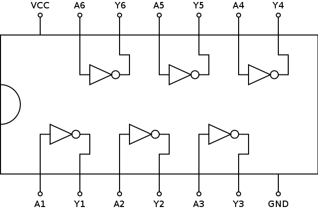

# 7404: Hex Inverter

- Type: [Gate](gates.md)
- DIP: 14-pin
- Number of elements: 6
- Inputs per element: 1
- Outputs per element: 1

## Description

Provides six hex inverters.

## Inputs and Outputs

| Label | Description            |
| ----- | ---------------------- |
| An    | Input of inverter n    |
| Yn    | Output of inverter n   |

## Function Table

| An  | Yn  |
|:---:|:---:|
| L   | H   |
| H   | L   |

- H: HIGH voltage level
- L: LOW voltage level

## Pin Configuration

## Datasheets

- [74HC04, 74HCT04 by NXP](http://www.nxp.com/documents/data_sheet/74HC_HCT04.pdf)
- [74HC04 by ON Semiconductor](http://www.onsemi.cn/pub/Collateral/74HC04.REV1.PDF)
- [7404, 74LS04, 74S04 by Texas Instruments](http://www.ti.com/lit/ds/symlink/sn74ls04.pdf)
