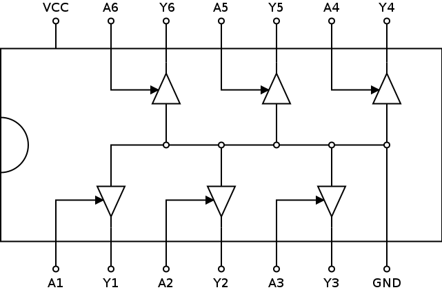

# 7404: hex inverter, open collector output

- Type: [inverter](inverters.md)
- DIP: 14-pin
- Number of elements: 6
- Inputs per element: 1
- Outputs per element: 1

## Description

Provides six inverters with open collector outputs.

## Inputs and outputs

| Label | Description          |
| ----- | -------------------- |
| An    | input of inverter n  |
| Yn    | output of inverter n |

## Function table

| An  | Yn  |
|:---:|:---:|
| L   | Z   |
| H   | L   |

- H: HIGH voltage level
- L: LOW voltage level
- Z: high-impedance OFF-state

## Pin layout

## Datasheets

- [74HC05, 74HCT05 by Nexperia](https://assets.nexperia.com/documents/data-sheet/74HC_HCT04.pdf)
