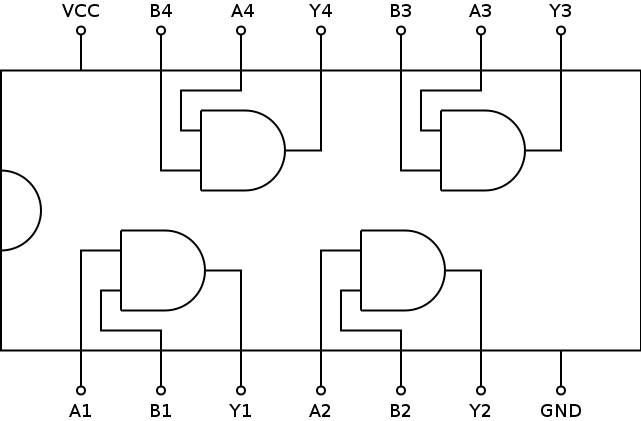

# 7408: Quad 2-Input AND Gate

- Type: [Gate](gates.md)
- DIP: 14-pin
- Number of elements: 4
- Inputs per element: 2
- Outputs per element: 1

## Description

Provides four AND gates with two inputs and an output each.

## Inputs and Outputs

| Label | Description            |
| ----- | ---------------------- |
| An    | First input of gate n  |
| Bn    | Second input of gate n |
| Yn    | Output of gate n       |

## Function Table

| An  | Bn  | Yn  |
|:---:|:---:|:---:|
| L   | L   | L   |
| L   | H   | L   |
| H   | L   | L   |
| H   | H   | H   |

- H: HIGH voltage level
- L: LOW voltage level

## Pin Configuration

## Datasheets

- [7408, 74LS08, 74S08 by Texas Instruments](http://www.ti.com.cn/cn/lit/ds/sdls033/sdls033.pdf)
- [74F08 by Philips](http://www.nxp.com/documents/data_sheet/74F08.pdf)
