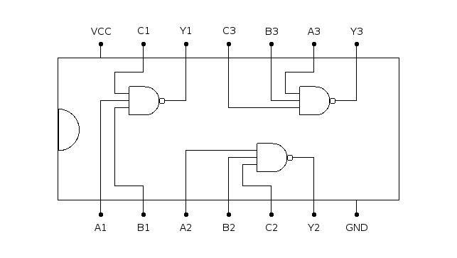

# 7410: Tripe 3-Input NAND Gate

- Type: [Gate](gates.md)
- DIP: 14-pin
- Number of elements: 3
- Inputs per element: 3
- Outputs per element: 1

## Description

Provides three NAND gates with three inputs and an output each.

## Inputs and Outputs

| Label | Description            |
| ----- | ---------------------- |
| An    | First input of gate n  |
| Bn    | Second input of gate n |
| Cn    | Third input of gate n  |
| Yn    | Output of gate n       |

## Function Table

| An  | Bn  | Cn  | Yn  |
|:---:|:---:|:---:|:---:|
| L   | X   | X   | H   |
| H   | L   | X   | H   |
| H   | H   | L   | H   |
| H   | H   | H   | L   |

- H: HIGH voltage level
- L: LOW voltage level
- X: don't care

## Pin Configuration

## Datasheets

- [74HC10, 74HCT10 by NXP](http://www.nxp.com/documents/data_sheet/74HC_HCT10_Q100.pdf)
- [74HC10, 74HCT10 by Philips](http://www.nxp.com/documents/data_sheet/74HC_HCT10_CNV.pdf)
- [74HC10 by Texas Instruments](http://www.farnell.com/datasheets/1847412.pdf)
