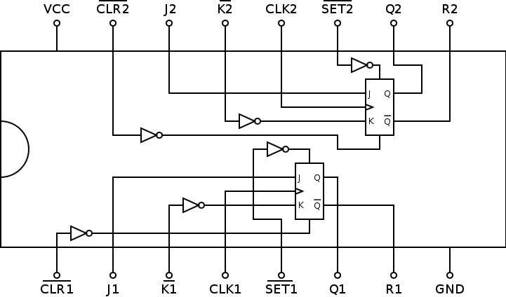

# 74109: dual J-not-K flip-flop

- Type: [flip-flop](flip_flops.md)
- DIP: 14-pin
- Number of elements: 2
- Trigger: Rising edge
- Asynchronous set and clear

## Description

Provides two J-Not-K positive-edge triggered flip-flops with set and clear function.

## Inputs and outputs

| Label | Description                    | Signal        |
| ----- | ------------------------------ | ------------- |
| Jn    | J input of flip-flop n         | active high   |
| Kn    | K input of flip-flop n         | active low    |
| SETn  | asynchronous set input         | active low    |
| CLRn  | asynchronous clear input       | active low    |
| CLKn  | clock for flip-flop n ()       | positive edge |
| Qn    | output of flip-flop n          | active high   |
| Rn    | inverted output of flip-flop n | active low    |

## Function table

| Function           | SETn | CLRn | CLKn | Jn  | Kn  | Qn  | Rn  |
| ------------------ |:----:|:----:|:----:|:---:|:---:|:---:|:---:|
| undetermined       |  L   |  L   |  X   |  X  |  X  |  H  |  H  |
| asynchronous set   |  L   |  H   |  X   |  X  |  X  |  H  |  L  |
| asynchronous clear |  H   |  L   |  X   |  X  |  X  |  L  |  H  |
| synchronous clear  |  H   |  H   |  /   |  L  |  L  |  L  |  H  |
| hold               |  H   |  H   |  /   |  L  |  H  | qn0 | rn0 |
| toggle             |  H   |  H   |  /   |  H  |  L  | rn0 | qn0 |
| synchronous set    |  H   |  H   |  /   |  H  |  H  |  H  |  L  |

- H: HIGH voltage level
- L: LOW voltage level
- X: don't care
- /: positive edge
- qn0: previous state of output Qn
- rn0: previous state of output Rn

## Pin layout

## Datasheets

- [CD74HC1099 by Texas Instruments](http://www.ti.com/lit/gpn/cd74hc109)
- [74HC109, 74HCT109 by Nexperia](https://assets.nexperia.com/documents/data-sheet/74HC_HCT109.pdf)
