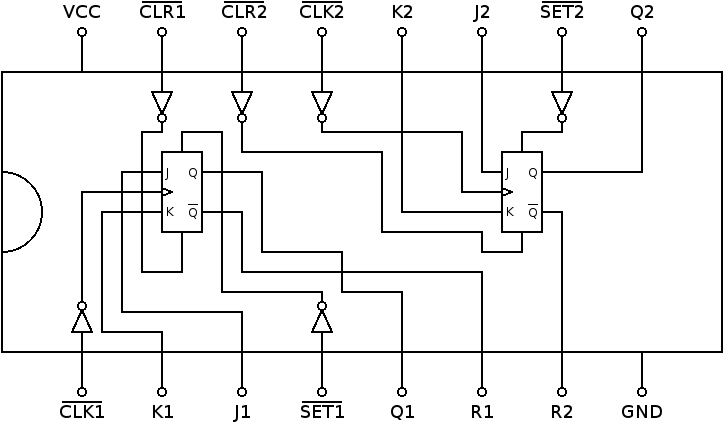

# 74112: Dual JK flip-flop with set and reset

- Type: [flip-flop](flip_flops.md)
- DIP: 16-pin
- Number of elements: 2
- Trigger: negative edge
- Asynchronous set and clear

## Description

Provides two J-K negative-edge triggered flip-flops with set and clear function.

## Inputs and outputs

| Label | Description                    | Signal        |
|:----- |:------------------------------ | ------------- |
| Jn    | J input of flip flop n         | active high   |
| Kn    | K input of flip flop n         | active high   |
| SETn  | asynchronous set input         | active low    |
| CLRn  | asynchronous clear input       | active low    |
| CLKn  | clock for flip flop n          | negative edge |
| Qn    | output of flip flop n          | active high   |
| Rn    | inverted output of flip flop n | active low    |

## Function table

| Function           | SETn | CLRn | CLKn | Jn  | Kn  | Qn  | Rn  |
|:------------------:|:----:|:----:|:----:|:---:|:---:|:---:|:---:|
| undetermined       | L    | L    | X    | X   | X   | H   | L   |
| asynchronous set   | L    | H    | X    | X   | X   | H   | L   |
| asynchronous clear | H    | L    | X    | X   | X   | L   | H   |
| hold               | H    | H    | \\   | L   | L   | qn0 | rn0 |
| synchronous clear  | H    | H    | \\   | L   | H   | L   | H   |
| synchronous set    | H    | H    | \\   | H   | L   | H   | L   |
| toggle             | H    | H    | \\   | H   | H   | rn0 | qn0 |

- H: HIGH voltage level
- L: LOW voltage level
- X: don't care
- \\: negative edge
- qn0: previous state of output Qn
- rn0: previous state of output Rn

## Pin layout

## Datasheets

- [CD74HC112 by Texas Instruments](http://www.ti.com/lit/gpn/cd74hc112)
- [74HC112, 74HCT112 by Nexperia](https://assets.nexperia.com/documents/data-sheet/74HC_HCT112.pdf)
