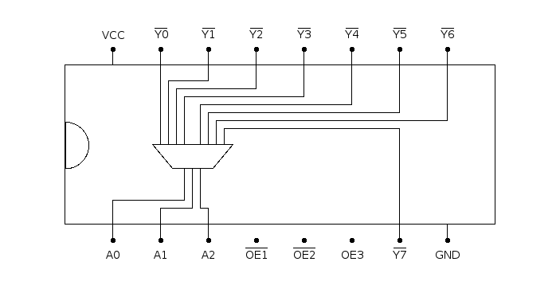

# 74138: 3-line to 8-line decoder, active low output

- Type: [decoder](encoders_decoders.md)
- DIP: 16-pin
- Input: 3-bit
- Output: 8 lines

## Description

This chip provides an 3-bit to eight line decoder with active low output.

## Inputs and outputs

| Label | Description                        |
|:----- |:---------------------------------- |
| An    | Encoded input                      |
| Yn    | Output (active low)                |
| OE1   | Output enable input 1 (active low) |
| OE2   | Output enable input 2 (active low) |
| OE3   | Output enable input 3              |

## Function table

| OE1 | OE2 | OE3 | A2  | A1  | A0  | Y7  | Y6  | Y5  | Y4  | Y3  | Y2  | Y1  | Y0  |
|:---:|:---:|:---:|:---:|:---:|:---:|:---:|:---:|:---:|:---:|:---:|:---:|:---:|:---:|
| H   | X   | X   | X   | X   | X   | H   | H   | H   | H   | H   | H   | H   | H   |
| X   | H   | X   | X   | X   | X   | H   | H   | H   | H   | H   | H   | H   | H   |
| X   | X   | L   | X   | X   | X   | H   | H   | H   | H   | H   | H   | H   | H   |
| L   | L   | H   | L   | L   | L   | H   | H   | H   | H   | H   | H   | H   | L   |
| L   | L   | H   | L   | L   | H   | H   | H   | H   | H   | H   | H   | L   | H   |
| L   | L   | H   | L   | H   | L   | H   | H   | H   | H   | H   | L   | H   | H   |
| L   | L   | H   | L   | H   | H   | H   | H   | H   | H   | L   | H   | H   | H   |
| L   | L   | H   | H   | L   | L   | H   | H   | H   | L   | H   | H   | H   | H   |
| L   | L   | H   | H   | L   | H   | H   | H   | L   | H   | H   | H   | H   | H   |
| L   | L   | H   | H   | H   | L   | H   | L   | H   | H   | H   | H   | H   | H   |
| L   | L   | H   | H   | H   | H   | L   | H   | H   | H   | H   | H   | H   | H   |

- H: HIGH voltage level
- L: LOW voltage level
- X: don't care

## Pin layout

## Datasheets

- [74HC138, 74HCT138 by Nexperia](https://assets.nexperia.com/documents/data-sheet/74HC_HCT138.pdf)
