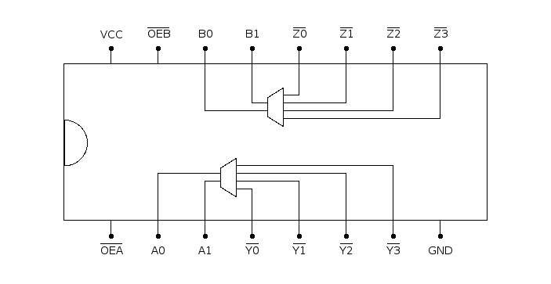

# 74139: dual 2-bit to 4-line decoder

- Type: [decoder](encoders_decoders.md)
- DIP: 16-pin
- Input: 2-bit
- Output: 4 lines

## Description

This chip provides two 2-bit to four line decoders with active low output.

## Inputs and outputs

| Label | Description                     | Signal      |
| ----- | ------------------------------- | ----------- |
| An    | encoded input of first decoder  | active high |
| Bn    | encoded input of second decoder | active high |
| Yn    | output of first decoder         | active low  |
| Zn    | output of second decoder        | active low  |
| OEA   | output enable of first decoder  | active low  |
| OEB   | output enable of second decoder | active low  |

## Function table

| OEA | A1  | A0  | Y3  | Y2  | Y1  | Y0  |
|:---:|:---:|:---:|:---:|:---:|:---:|:---:|
|  H  |  X  |  X  |  X  |  X  |  X  |  H  |
|  L  |  L  |  L  |  H  |  H  |  H  |  L  |
|  L  |  L  |  H  |  H  |  H  |  L  |  H  |
|  L  |  H  |  L  |  H  |  L  |  H  |  H  |
|  L  |  H  |  H  |  L  |  H  |  H  |  H  |

| OEB | B1  | B0  | Z3  | Z2  | Z1  | Z0  |
|:---:|:---:|:---:|:---:|:---:|:---:|:---:|
|  H  |  X  |  X  |  X  |  X  |  X  |  H  |
|  L  |  L  |  L  |  H  |  H  |  H  |  L  |
|  L  |  L  |  H  |  H  |  H  |  L  |  H  |
|  L  |  H  |  L  |  H  |  L  |  H  |  H  |
|  L  |  H  |  H  |  L  |  H  |  H  |  H  |

- H: HIGH voltage level
- L: LOW voltage level
- X: don't care

## Pin layout

## Datasheets

- [CD74HC139 by Texas Instruments](http://www.ti.com/lit/gpn/cd74hc139)
- [74HC139 74HCT139 by Nexperia](https://assets.nexperia.com/documents/data-sheet/74HC_HCT139.pdf)
