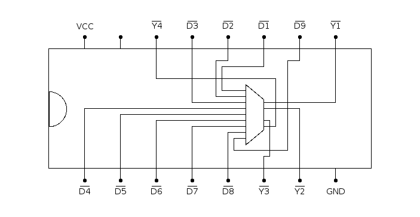

# 74147: 10-line to 4-line priority encoder, active low

- Type: [encoder](encoders_decoders.md)
- DIP: 16-pin
- Input: 9 lines
- Output: 4-bit BCD

## Description

Encodes nine input lines to a 4-bit binary output. The number of the highest line with a low voltage input is encoded an inverted 4-bit binary number.

## Inputs and outputs

| Label | Description  | Signal     |
|:----- |:------------ | ---------- |
| Dn    | input lines  | active low |
| Y1    | bit 0 output | active low |
| Y2    | bit 1 output | active low |
| Y3    | bit 2 output | active low |
| Y4    | bit 3 output | active low |

## Function table

| D1  | D2  | D3  | D4  | D5  | D6  | D7  | D8  | D9  | Y4  | Y3  | Y2  | Y1  |
|:---:|:---:|:---:|:---:|:---:|:---:|:---:|:---:|:---:|:---:|:---:|:---:|:---:|
|  H  |  H  |  H  |  H  |  H  |  H  |  H  |  H  |  H  |  H  |  H  |  H  |  H  |
|  X  |  X  |  X  |  X  |  X  |  X  |  X  |  X  |  L  |  L  |  H  |  H  |  L  |
|  X  |  X  |  X  |  X  |  X  |  X  |  X  |  L  |  H  |  L  |  H  |  H  |  H  |
|  X  |  X  |  X  |  X  |  X  |  X  |  L  |  H  |  H  |  H  |  L  |  L  |  L  |
|  X  |  X  |  X  |  X  |  X  |  L  |  H  |  H  |  H  |  H  |  L  |  L  |  H  |
|  X  |  X  |  X  |  X  |  L  |  H  |  H  |  H  |  H  |  H  |  L  |  H  |  L  |
|  X  |  X  |  X  |  L  |  H  |  H  |  H  |  H  |  H  |  H  |  L  |  H  |  H  |
|  X  |  X  |  L  |  H  |  H  |  H  |  H  |  H  |  H  |  H  |  H  |  L  |  L  |
|  X  |  L  |  H  |  H  |  H  |  H  |  H  |  H  |  H  |  H  |  H  |  L  |  H  |
|  L  |  H  |  H  |  H  |  H  |  H  |  H  |  H  |  H  |  H  |  H  |  H  |  L  |

- H: HIGH voltage level
- L: LOW voltage level
- X: don't care

## Pin layout

## Datasheets

- [CD74HC147 by Texas Instruments](http://www.ti.com/lit/gpn/cd74hc147)
