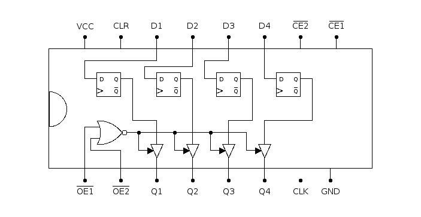

# 74173: quad D-type flip-flop

- Type: [flip-flop](flip_flops.md)
- DIP: 16-pin
- Number of elements: 4
- Trigger: positive edge

## Description

Provides four positive-edge triggered D-type flip-flops with input enable and output enable.

## Inputs and outputs

| Label | Description               | Signal        |
|:----- |:------------------------- | ------------- |
| Dn    | data input of flip-flop n | active high   |
| CE1   | clock enable 1            | active low    |
| CE2   | clock enable 2            | active low    |
| CLK   | common clock              | positive edge |
| CLR   | common asynchronous clear | active high   |
| OE1   | output enable 1           | active low    |
| OE2   | output enable 2           | active low    |
| Qn    | output of flip-flop n     | active high   |

## Function table

| Function           | CLR | CLK | CE1 | CE2 | Dn  | Qn  |
| ------------------ |:---:|:---:|:---:|:---:|:---:|:---:|
|                    |  L  |  L  |  X  |  X  |  X  | qn0 |
| clock disabled     |  L  |  /  |  H  |  X  |  X  | qn0 |
| clock disabled     |  L  |  /  |  X  |  H  |  X  | qn0 |
| synchronous clear  |  L  |  /  |  L  |  L  |  L  |  L  |
| synchronous set    |  L  |  /  |  L  |  L  |  H  |  H  |
| asynchronous clear |  H  |  X  |  X  |  X  |  X  |  L  |

- H: HIGH voltage level
- L: LOW voltage level
- X: don't care
- /: positive edge
- qn0: previous state of output Qn

## Pin layout

## Datasheets

- [CD74HC173 by Texas Instruments](http://www.ti.com/lit/gpn/cd74hc173)
- [74HC173, 74HCT173 by Nexperia](https://assets.nexperia.com/documents/data-sheet/74HC_HCT173.pdf)
