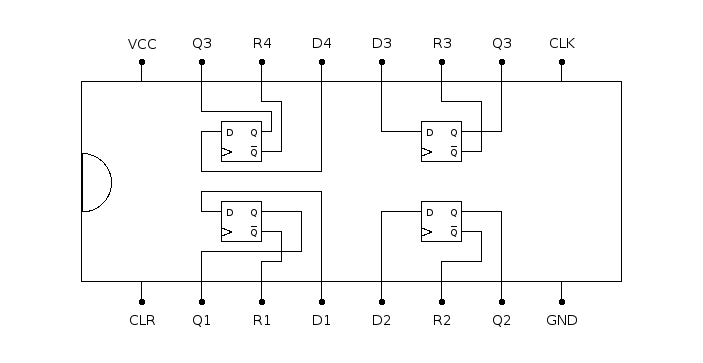

# 74175: quad D flip-flop

- Type: [flip-flop](flip_flops.md)
- DIP: 16-pin
- Number of elements: 4
- Trigger: positive edge

## Pin layout

## Datasheets

- [74HC175, 74HCT174 by Nexperia](https://assets.nexperia.com/documents/data-sheet/74HC_HCT175.pdf)
