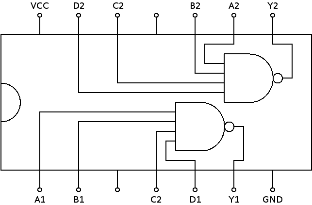

# 7420: dual 4-input NAND gate

- Type: [gate](gates.md)
- DIP: 14-pin
- Number of elements: 2
- Inputs per element: 4
- Outputs per element: 1

## Description

Provides two NAND gates with four inputs and an output each.

## Inputs and outputs

| Label | Description            |
| ----- | ---------------------- |
| An    | First input of gate n  |
| Bn    | Second input of gate n |
| Cn    | Third input of gate n  |
| Dn    | Fourth input of gate n |
| Yn    | Output of gate n       |

## Function table

| An  | Bn  | Cn  | Dn  | Yn  |
|:---:|:---:|:---:|:---:|:---:|
| L   | X   | X   | X   | H   |
| X   | L   | X   | X   | H   |
| X   | X   | L   | X   | H   |
| X   | X   | X   | L   | H   |
| H   | H   | H   | H   | L   |

- H: HIGH voltage level
- L: LOW voltage level
- X: don't care

## Pin layout

## Datasheets

- [74HC20, 74HCT20 by Nexperia](https://assets.nexperia.com/documents/data-sheet/74HC_HCT20.pdf)
