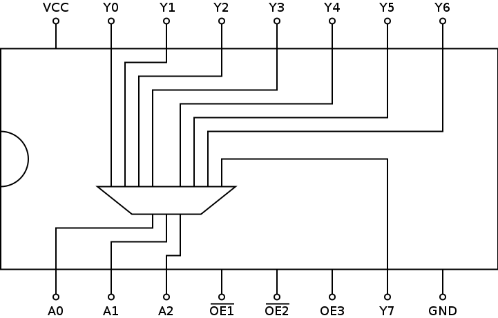

# 74238: 3-line to 8-line decoder

- Type: [decoder](encoders_decoders.md)
- DIP: 16-pin
- Input: 3-bit
- Output: 8 lines

## Description

This chip provides an 3-bit to eight line decoder.

## Inputs and outputs

| Label | Description           | Signal      |
| ----- | --------------------- | ----------- |
| An    | encoded input         | active high |
| Yn    | output                | active high |
| OE1   | output enable input 1 | active low  |
| OE2   | output enable input 2 | active low  |
| OE3   | output enable input 3 | active high |

## Function table

| OE1 | OE2 | OE3 | A2  | A1  | A0  | Y7  | Y6  | Y5  | Y4  | Y3  | Y2  | Y1  | Y0  |
|:---:|:---:|:---:|:---:|:---:|:---:|:---:|:---:|:---:|:---:|:---:|:---:|:---:|:---:|
|  H  |  X  |  X  |  X  |  X  |  X  |  L  |  L  |  L  |  L  |  L  |  L  |  L  |  L  |
|  X  |  H  |  X  |  X  |  X  |  X  |  L  |  L  |  L  |  L  |  L  |  L  |  L  |  L  |
|  X  |  X  |  L  |  X  |  X  |  X  |  L  |  L  |  L  |  L  |  L  |  L  |  L  |  L  |
|  L  |  L  |  H  |  L  |  L  |  L  |  L  |  L  |  L  |  L  |  L  |  L  |  L  |  H  |
|  L  |  L  |  H  |  L  |  L  |  H  |  L  |  L  |  L  |  L  |  L  |  L  |  H  |  L  |
|  L  |  L  |  H  |  L  |  H  |  L  |  L  |  L  |  L  |  L  |  L  |  H  |  L  |  L  |
|  L  |  L  |  H  |  L  |  H  |  H  |  L  |  L  |  L  |  L  |  H  |  L  |  L  |  L  |
|  L  |  L  |  H  |  H  |  L  |  L  |  L  |  L  |  L  |  H  |  L  |  L  |  L  |  L  |
|  L  |  L  |  H  |  H  |  L  |  H  |  L  |  L  |  H  |  L  |  L  |  L  |  L  |  L  |
|  L  |  L  |  H  |  H  |  H  |  L  |  L  |  H  |  L  |  L  |  L  |  L  |  L  |  L  |
|  L  |  L  |  H  |  H  |  H  |  H  |  H  |  L  |  L  |  L  |  L  |  L  |  L  |  L  |

- H: HIGH voltage level
- L: LOW voltage level
- X: don't care

## Pin layout

## Datasheets

- [CD74HC238 by Texas Instruments](http://www.ti.com/lit/gpn/cd74hc238)
