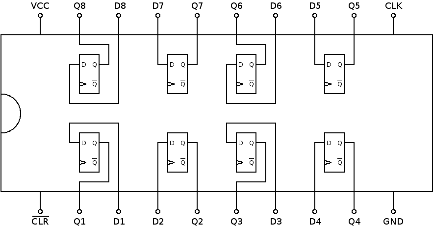

# 74273: octal D-type flip-flop

- Type: [flip-flop](flip_flops.md)
- DIP: 20-pin
- Number of elements: 8
- Trigger: positive edge

## Description

Provides eight positive-edge triggered D-type flip-flops with a common asynchronous clear.

## Inputs and outputs

| Label | Description        | Signal        |
| ----- | ------------------ | ------------- |
| Dn    | input n            | active high   |
| Qn    | output n           | active high   |
| CLK   | clock              | positive edge |
| CLR   | asynchronous clear | active low    |

## Function table

| CLR | CLK | Dn  | Qn  |
|:---:|:---:|:---:|:---:|
|  H  |  X  |  X  |  L  |
|  L  |  /  |  H  |  H  |
|  L  |  /  |  L  |  L  |
|  L  |  X  |  X  | qn0 |

- H: HIGH voltage level
- L: LOW voltage level
- X: don't care
- /: positive edge
- qn0: previous state of Qn

## Pin layout

## Datasheets

- [CD74HC273 by Texas Instruments](http://www.ti.com/lit/gpn/cd74hc273)
- [74HC273, 74HCT273 by NXT](http://www.nxp.com/documents/data_sheet/74HC_HCT273.pdf)
