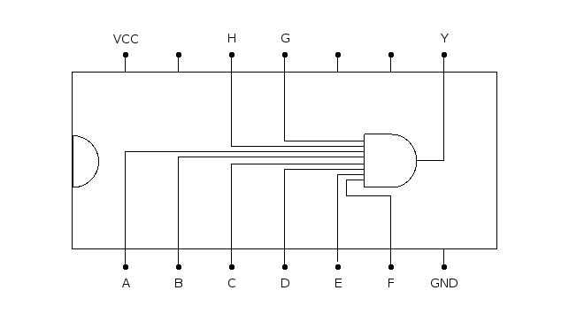

# 7430: 8-input NAND gate

- Type: [Gate](gates.md)
- DIP: 14-pin
- Number of elements: 1
- Inputs per element: 8
- Outputs per element: 1

## Description

Provides a NAND gate with eight inputs.

## Inputs and outputs

| Label | Description           |
| ----- | --------------------- |
| A     | first input of gate   |
| B     | second input of gate  |
| C     | third input of gate   |
| D     | fourth input of gate  |
| E     | fifth  input of gate  |
| F     | sixth  input of gate  |
| G     | seventh input of gate |
| H     | eighth input of gate  |
| Y     | output of gate        |

## Function table

| A   | B   | C   | D   | E   | F   | G   | H   | Y   |
|:---:|:---:|:---:|:---:|:---:|:---:|:---:|:---:|:---:|
| L   | X   | X   | X   | X   | X   | X   | X   | H   |
| X   | L   | X   | X   | X   | X   | X   | X   | H   |
| X   | X   | L   | X   | X   | X   | X   | X   | H   |
| X   | X   | X   | L   | X   | X   | X   | X   | H   |
| X   | X   | X   | X   | L   | X   | X   | X   | H   |
| X   | X   | X   | X   | X   | L   | X   | X   | H   |
| X   | X   | X   | X   | X   | X   | L   | X   | H   |
| X   | X   | X   | X   | X   | X   | X   | L   | H   |
| H   | H   | H   | H   | H   | H   | H   | H   | L   |

- H: HIGH voltage level
- L: LOW voltage level
- X: don't care

## Pin layout

## Datasheets

- [74HC30, 74HCT30 by Nexperia](https://assets.nexperia.com/documents/data-sheet/74HC_HCT30.pdf)
- [7430, 74LS30, 74S30 by Texas Instruments](http://www.ti.com.cn/cn/lit/ds/symlink/sn7430.pdf)
