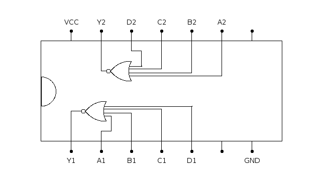

# 744002: dual 4-input NOR gate

- Type: [gate](gates.md)
- DIP: 14-pin
- Number of elements: 2
- Inputs per element: 4
- Outputs per element: 1

## Description

Provides two NOR gates with four inputs and an output each.

## Inputs and outputs

| Label | Description            |
| ----- | ---------------------- |
| An    | first input of gate n  |
| Bn    | second input of gate n |
| Cn    | third input of gate n  |
| Dn    | fourth input of gate n |
| Yn    | output of gate n       |

## Function table

| An  | Bn  | Cn  | Dn  | Yn  |
|:---:|:---:|:---:|:---:|:---:|
|  L  |  L  |  L  |  L  |  H  |
|  H  |  X  |  X  |  X  |  L  |
|  X  |  H  |  X  |  X  |  L  |
|  X  |  X  |  H  |  X  |  L  |
|  X  |  X  |  X  |  H  |  L  |

- H: HIGH voltage level
- L: LOW voltage level
- X: don't care

## Pin layout

## Datasheets

[CD74HC4002 by Texas Instruments](http://www.ti.com/lit/gpn/cd74hc4002)
