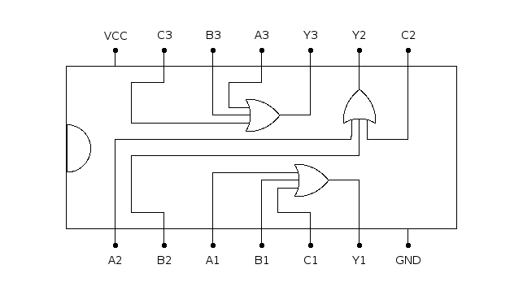

# 744075: triple 3-input OR gate

- Type: [gate](gates.md)
- DIP: 14-pin
- Number of elements: 3
- Inputs per element: 3
- Outputs per element: 1

## Description

Provides three OR gates with three inputs and an output each.

## Inputs and outputs

| Label | Description            |
| ----- | ---------------------- |
| An    | first input of gate n  |
| Bn    | second input of gate n |
| Cn    | third input of gate n  |
| Yn    | output of gate n       |

## Function table

| An  | Bn  | Cn  | Yn  |
|:---:|:---:|:---:|:---:|
|  L  |  L  |  L  |  L  |
|  H  |  X  |  X  |  H  |
|  X  |  H  |  X  |  H  |
|  X  |  X  |  H  |  H  |

- H: HIGH voltage level
- L: LOW voltage level
- X: don't care

## Pin layout

## Datasheets

- [74HC4057, 74HCT4075 by Nexperia](https://assets.nexperia.com/documents/data-sheet/74HC_HCT4075.pdf)
- [CD74HC4075 by Texas Instruments](http://www.ti.com/lit/gpn/cd74hc4075)
