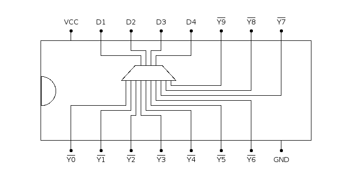

# 7442: BCD to decimal decoder, active low output

- Type: [decoder](encoders_decoders.md)
- DIP: 16-pin
- Input: 4-bit BCD
- Output: 10 lines

## Description

Decodes a 4-bit BCD to ten output lines.

## Inputs and outputs

| Label | Description  | Signal      |
| ----- | ------------ | ----------- |
| Dn    | input lines  | active high |
| Yn    | output lines | active low  |

## Function table

| D4  | D3  | D2  | D1  | Y0  | Y1  | Y2  | Y3  | Y4  | Y5  | Y6  | Y7  | Y8  | Y9  |
|:---:|:---:|:---:|:---:|:---:|:---:|:---:|:---:|:---:|:---:|:---:|:---:|:---:|:---:|
|  L  |  L  |  L  |  L  |  L  |  H  |  H  |  H  |  H  |  H  |  H  |  H  |  H  |  H  |
|  L  |  L  |  L  |  H  |  H  |  L  |  H  |  H  |  H  |  H  |  H  |  H  |  H  |  H  |
|  L  |  L  |  H  |  L  |  H  |  H  |  L  |  H  |  H  |  H  |  H  |  H  |  H  |  H  |
|  L  |  L  |  H  |  H  |  H  |  H  |  H  |  L  |  H  |  H  |  H  |  H  |  H  |  H  |
|  L  |  H  |  L  |  L  |  H  |  H  |  H  |  H  |  L  |  H  |  H  |  H  |  H  |  H  |
|  L  |  H  |  L  |  H  |  H  |  H  |  H  |  H  |  H  |  L  |  H  |  H  |  H  |  H  |
|  L  |  H  |  H  |  L  |  H  |  H  |  H  |  H  |  H  |  H  |  L  |  H  |  H  |  H  |
|  L  |  H  |  H  |  H  |  H  |  H  |  H  |  H  |  H  |  H  |  H  |  L  |  H  |  H  |
|  H  |  L  |  L  |  L  |  H  |  H  |  H  |  H  |  H  |  H  |  H  |  H  |  L  |  H  |
|  H  |  L  |  L  |  H  |  H  |  H  |  H  |  H  |  H  |  H  |  H  |  H  |  H  |  L  |
|  H  |  L  |  H  |  X  |  H  |  H  |  H  |  H  |  H  |  H  |  H  |  H  |  H  |  H  |
|  H  |  H  |  X  |  X  |  H  |  H  |  H  |  H  |  H  |  H  |  H  |  H  |  H  |  H  |

- H: HIGH voltage level
- L: LOW voltage level
- X: don't care

## Pin layout

## Datasheets

- [74HC42, 74HCT42 by Nexperia](https://assets.nexperia.com/documents/data-sheet/74HC42.pdf)
- [7442A, 74LS42 by Texas Instruments](http://www.farnell.com/datasheets/1446836.pdf)
