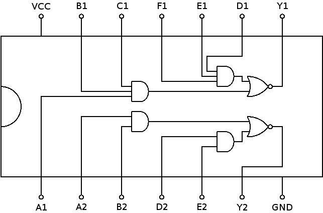

# 7451: AND-OR-invert gates

- Type: [gate](gates.md)
- DIP: 14-pin
- Number of elements: 2
- Inputs per element: 4/6
- Outputs per element: 1

## Description

Provides two AND-OR-invert gates with two or three inputs per NAND gate. The basic model has
only two inputs per NAND gate, the SN74LS51 has an additional input E1 and F1 for each NAND gate
of the first element.

## Inputs and outputs

| Label | Description                                           |
| ----- | ----------------------------------------------------- |
| An    | first input of first NAND gate of element n           |
| Bn    | second input of first NAND gate of element n          |
| Cn    | optional third input of first NAND gate of element 1  |
| D1    | first input of second NAND gate of element n          |
| En    | second input of second NAND gate of element n         |
| F1    | optional third input of second NAND gate of element 1 |
| Yn    | output of element n                                   |

## Function table

Function table for element with four inputs:

| An  | Bn  | Dn  | En  | Yn  |
|:---:|:---:|:---:|:---:|:---:|
| L   | X   | L   | X   | H   |
| L   | X   | X   | L   | H   |
| X   | L   | L   | X   | H   |
| X   | L   | X   | L   | H   |
| H   | H   | X   | X   | L   |
| X   | X   | H   | H   | L   |

Function table for element with six inputs:

| A1  | B1  | C1  | D1  | E1  | F1  | Yn  |
|:---:|:---:|:---:|:---:|:---:|:---:|:---:|
| L   | X   | X   | L   | X   | X   | H   |
| L   | X   | X   | X   | L   | X   | H   |
| L   | X   | X   | X   | X   | L   | H   |
| X   | L   | X   | L   | X   | X   | H   |
| X   | L   | X   | X   | L   | X   | H   |
| X   | L   | X   | X   | X   | L   | H   |
| X   | X   | L   | L   | X   | X   | H   |
| X   | X   | L   | X   | L   | X   | H   |
| X   | X   | L   | X   | X   | L   | H   |
| H   | H   | H   | X   | X   | X   | L   |
| X   | X   | X   | H   | H   | H   | L   |

- H: HIGH voltage level
- L: LOW voltage level
- X: don't care

## Pin layout

## Datasheets

- [SN74LS51 by Texas Instruments](http://www.ti.com/lit/gpn/sn74ls51)
