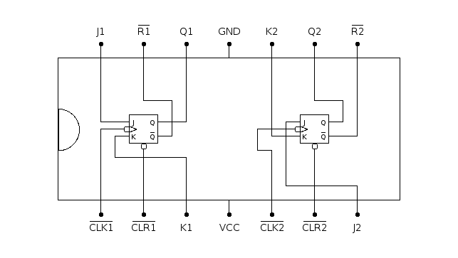

# 7473: dual J-K flip-flop, negative-edge trigger

- Type: [flip-flop](flip_flops.md)
- DIP: 14-pin
- Number of elements: 2
- Trigger: Falling edge
- Asynchronous clear

## Description

Provides two J-K negative-edge triggered flip-flops with asynchronous clear function.

## Inputs and outputs

| Label | Description                                 |
|:----- |:------------------------------------------- |
| Jn    | J input of flip-flop n                      |
| Kn    | K input of flip-flop n                      |
| CLRn  | Asynchronous clear input (active low)       |
| CLKn  | Clock for flip-flop n (negative-edge)       |
| Qn    | Output of flip-flop n                       |
| Rn    | Inverted output of flip-flop n              |

## Function table

| Function           | CLRn | CLKn | Jn  | Kn  | Qn  | Rn  |
|:------------------:|:----:|:----:|:---:|:---:|:---:|:---:|
| asynchronous clear | L    | X    | X   | X   | L   | H   |
| hold               | H    | \\   | L   | L   | qn0 | rn0 |
| synchronous clear  | H    | \\   | L   | H   | L   | H   |
| synchronous set    | H    | \\   | H   | L   | H   | L   |
| toggle             | H    | \\   | H   | H   | rn0 | qn0 |
| no change          | H    | H    | X   | X   | qn0 | rn0 |

- H: HIGH voltage level
- L: LOW voltage level
- X: don't care
- \\: negative edge
- qn0: previous state of output Qn
- rn0: previous state of output Rn

## Pin layout

## Datasheets

- [74HC73, 74HCT73 by Nexperia](https://assets.nexperia.com/documents/data-sheet/74HC73.pdf)
