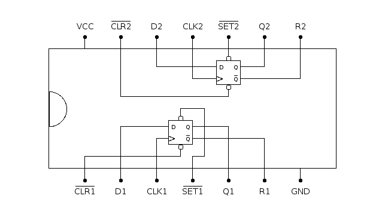

# 7474: dual D flip-flop

- Type: [flip-flop](flip_flops.md)
- DIP: 14-pin
- Number of elements: 2
- Trigger: positive edge
- Asynchronous set and clear

## Description

Provides two positive-edge triggered D flip-flops with asynchronous set and clear function.

## Inputs and outputs

| Label | Description                                |
|:----- |:------------------------------------------ |
| Dn    | Data input of flip-flop n                  |
| SETn  | Asynchronous set input (active low)        |
| CLRn  | Asynchronous clear input (active low)      |
| CLKn  | Clock for flip-flop n (positive edge)      |
| Qn    | Output of flip-flop n                      |
| Rn    | Inverted output of flip-flop               |

## Function table

| SETn | CLRn | CLKn | Dn  | Qn  | Rn   |
|:----:|:----:|:----:|:---:|:---:|:----:|
| L    | H    | X    | X   | H   | L    |
| H    | L    | X    | X   | L   | H    |
| L    | L    | X    | X   | U   | U    |
| H    | H    | /    | H   | H   | L    |
| H    | H    | /    | L   | L   | H    |
| H    | H    | L    | X   | qn0 | rn0  |

- H: HIGH voltage level
- L: LOW voltage level
- X: don't care
- /: positive edge
- U: unstable/undefined
- qn0: previous state of output Qn
- rn0: previous state of output Rn

## Pin layout

## Datasheets

- [SN7474, SN74LS74, SN74S74 by Texas Instruments](http://www.farnell.com/datasheets/1831293.pdf)
- [74HC74, 74HCT74 by Nexperia](https://assets.nexperia.com/documents/data-sheet/74HC_HCT74.pdf)
