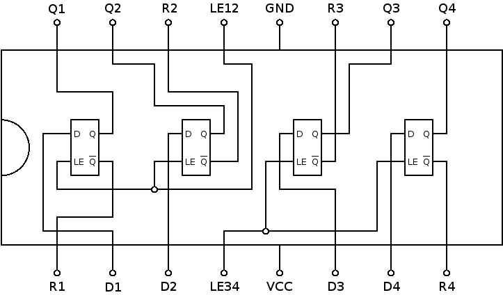

# 7475: quad D latch

- Type: [flip-flop](flip_flops.md)
- DIP: 16-pin
- Number of elements: 4
- Trigger: Rising edge

## Description

Provides four positive-edge triggered D latches. Two latches share a
load enable input each.

## Inputs and outputs

| Label | Description                     | Signal      |
|:----- |:------------------------------- | ----------- |
| Dn    | data input of D latch           | active high |
| LEnm  | load enable for latches n and m | active high |
| Qn    | output of latch n               | active high |
| Rn    | inverted output of latch n      | active low  |

## Function table

| LEnm | Dn  | Qn  | Rn   |
|:----:|:---:|:---:|:----:|
| H    | L   | L   | H    |
| H    | H   | H   | L    |
| L    | X   | qn0 | rn0  |

- H: HIGH voltage level
- L: LOW voltage level
- X: don't care
- qn0: previous state of output Qn
- rn0: previous state of output Rn

## Pin layout

## Datasheets

- [74HC75, 74HCT75 by Texas Instruments](http://www.ti.com/lit/ds/symlink/cd74hc75.pdf)
- [74HC75 by Nexperia](https://assets.nexperia.com/documents/data-sheet/74HC75.pdf)
