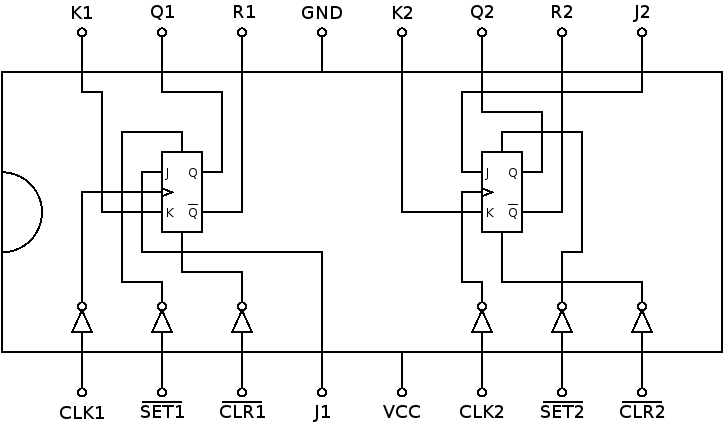

# 7476: dual J-K flip-flop, negative-edge trigger

- Type: [flip-flop](flip_flops.md)
- DIP: 16-pin
- Number of elements: 2
- Trigger: negative edge
- Asynchronous set and clear

## Description

Provides two J-K negative-edge triggered flip-flops with set and clear function.

## Inputs and outputs

| Label | Description                                 |
|:----- |:------------------------------------------- |
| Jn    | J input of flip flop n                      |
| Kn    | K input of flip flop n                      |
| SETn  | Asynchronous set input (active low)         |
| CLRn  | Asynchronous clear input (active low)       |
| CLKn  | Clock for flip flop n (negative edge)       |
| Qn    | Output of flip flop n                       |
| Rn    | Inverted output of flip flop n              |

## Function table

| Function           | SETn | CLRn | CLKn | Jn  | Kn  | Qn  | Rn  |
|:------------------:|:----:|:----:|:----:|:---:|:---:|:---:|:---:|
| undetermined       | L    | L    | X    | X   | X   | L   | L   |
| asynchronous set   | L    | H    | X    | X   | X   | H   | L   |
| asynchronous clear | H    | L    | X    | X   | X   | L   | H   |
| hold               | H    | H    | \\   | L   | L   | qn0 | rn0 |
| synchronous clear  | H    | H    | \\   | L   | H   | L   | H   |
| synchronous set    | H    | H    | \\   | H   | L   | H   | L   |
| toggle             | H    | H    | \\   | H   | H   | rn0 | qn0 |

- H: HIGH voltage level
- L: LOW voltage level
- X: don't care
- \\: negative edge
- qn0: previous state of output Qn
- rn0: previous state of output Rn

## Pin layout

## Datasheets

- [7476, 74LS76 by Texas Instruments](http://www.ti.com/lit/ds/symlink/sn5476.pdf)
