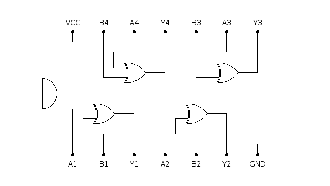

# 7486: quad 2-input XOR gate

- Type: [gate](gates.md)
- DIP: 14-pin
- Number of elements: 4
- Inputs per element: 2
- Outputs per element: 1

## Description

Provides four XOR gates with two inputs and an output each.

## Inputs and outputs

| Label | Description            |
| ----- | ---------------------- |
| An    | first input of gate n  |
| Bn    | second input of gate n |
| Yn    | output of gate n       |

## Function table

| An  | Bn  | Yn  |
|:---:|:---:|:---:|
| L   | L   | L   |
| L   | H   | H   |
| H   | L   | H   |
| H   | H   | L   |

- H: HIGH voltage level
- L: LOW voltage level

## Pin layout

## Datasheets

- [74HC86, 74HCT86 by Nexperia](https://assets.nexperia.com/documents/data-sheet/74HC_HCT86.pdf)
